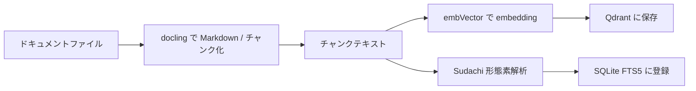

# docsearch — ドキュメント変換・Embedding・検索アプリケーション

短い説明: 指定ディレクトリ配下のドキュメント（PDF / Word / Excel / Markdown 等）を Markdown に変換し、形態素解析で抽出した名詞・動詞を SQLite(FTS5) に登録、チャンク化したテキストを埋め込み（embedding）して Qdrant に保存することで、高速な全文検索と意味検索（ベクトル検索）を提供するアプリケーションです。

---

## 主要機能

- ドキュメントの自動変換（docling を利用）→ Markdown チャンク化
- 形態素解析（Sudachi）で名詞・動詞を抽出し、SQLite(FTS5) に登録
- チャンク毎に embedding を生成して Qdrant に格納（ベクトル検索対応）
- PySide6 ベースのシンプルな GUI（全文検索 & ベクトル検索）

---

## すぐに試す（クイックスタート）

前提:
- Python 3.11 以上
- ローカルにモデルファイル（gguf 形式）を配置すること

仮想環境の作成と依存パッケージのインストール例:

```bash
python -m venv venv
source venv/bin/activate
pip install -U pip
pip install docling docling-core
pip install llama-cpp-python
pip install qdrant-client
pip install sudachipy sudachidict_core PySide6 python-dotenv
```

モデルの配置（説明のみ）:
- embedding 用推奨モデル: `embeddinggemma-300M-Q8_0.gguf`（埋め込み生成用、モデル次元: 768）
- 利用可能な補助 LLM: `Qwen3.5-4B-Q4_K_M.gguf`, `Qwen3.5-0.8B-Q4_K_M.gguf`, `google_gemma-4-E2B-it-Q4_K_M.gguf` など（推論／スコアリング用途）

モデルは大きく、ダウンロード先や利用条件はモデルの配布ページを参照してください。本リポジトリではモデル自動ダウンロードは行いません。ダウンロード後、プロジェクトルート直下（例: `models/`）に配置してください。

---

## 実行方法（開発者向け）

- ドキュメントをベクトルデータベースと SQLite に登録する:

```bash
python documents_to_db.py
```

デフォルトではスクリプトはハードコーディングされたパスを使います（デフォルト実行: `/home/ishii/data` を走査し、拡張子 `.pdf`, `.docx`, `.pptx`, `.xlsx`, `.md` を処理）。コレクション名は環境変数 `VECTOR_DB_COLLECTION`（デフォルト `docvec`）に基づきます。

- GUI を起動して検索 (ローカル):

```bash
python main.py    # PySide6 でビルド済み UI を使用
python main2.py   # QUiLoader を使う別の起動方法（動的ロード）
```

---

## エンドユーザー向け: GUI 操作ガイド

- 起動後、ウィンドウに検索バーが 2 つあります。
  - 上段の検索バー: SQLite(FTS5) に登録されたキーワードベースの全文検索（キーワード / フレーズ検索）
  - 下段の検索バー: ベクトル検索（自然文クエリ → embedding → Qdrant 類似検索）
- 検索件数は右の数値入力（spin box）で設定できます。
- 「全文検索」ボタン: FTS5 テーブルからマッチするドキュメントの断片（ファイル名、ページ、抜粋）を返します。
- 「意味検索」ボタン: 入力文の埋め込みを計算して Qdrant を検索し、類似するチャンクを返します。結果は本文の抜粋・ページ番号・ファイル名が表示されます。

使い方のポイント:
- 短いキーワードや正確な語句を使うと FTS5 の精度が高くなります。
- 自然言語での質問や曖昧な表現はベクトル検索が有利です。

---

## 設定と環境変数

`.env` に設定可能な項目（デフォルト値）:

- `VECTOR_DB_DIR` — `qdrant_data`（Qdrant のデータ格納ディレクトリ）
- `VECTOR_DB_COLLECTION` — `docvec`（メインのコレクション名）
- `SQLITE_DB` — `words.sqlite3`（SQLite データベースファイル）
- `WORDS_TABLE` — `words`（FTS5 テーブル名）

補足: 現状メインのインジェスト処理はスクリプト内でハードコーディングされた入力ディレクトリ(`/home/ishii/data`)を使うため、`.env` の設定だけでは入力元を変更できません。必要なら CLI 引数や設定ファイル経由で変更することを推奨します。

---

## 内部構造とデータフロー

概要:

1. 指定ディレクトリを再帰走査して対象ファイルを収集
2. `docling` を使ってドキュメントを Markdown に変換、階層的にチャンク化（`MdChunk` 相当）
3. 各チャンクのテキストを `embVector` で embedding（ベクトル）に変換
4. チャンク単位で Qdrant に `Point` として保存（payload に `text`, `file_name`, `pages`, `headings` を含む）
5. 同時に形態素解析（Sudachi）で名詞・動詞を抽出し、`TxtSerch` 経由で SQLite(FTS5) に登録

図のプレースホルダ（後で図を追加ください）:

- 図 1: データフロー図 — "入力ファイル → docling変換 → チャンク → embedding → Qdrant" の流れを矢印で示す
- 図 2: 検索フロー図 — "ユーザ入力（全文/ベクトル）→ FTS5 or Qdrant → 結果表示"



---

## DB スキーマ（簡易）

- SQLite (FTS5) テーブル（例）:

```sql
CREATE VIRTUAL TABLE words USING fts5(
  file_path UNINDEXED,
  pages UNINDEXED,
  text,
  tokenize='unicode61'
);
```

- Qdrant のコレクションと payload（例）:

```
collection: docvec
point.payload = {
  "text": "チャンクの本文...",
  "file_name": "/path/to/file.pdf",
  "pages": [1,2],
  "headings": ["Section 1","Subsection A"]
}
```

---

## 実装上の注意点 / トラブルシューティング

- モデルファイルのパスがコード内で期待される場所にあるか確認してください（`lib/gen_emb_vector.py` 内に `model_path` が設定されています）。
- Sudachi トークナイザは本番で有効にするには辞書（sudachidict_core）をインストールし、`lib/tokenize_keywords.py` の `dummy` 設定を確認してください。
- 大きなモデルや大量ドキュメントを処理する場合はメモリとディスク容量に注意してください。Qdrant はディスクを多く使います。
- 再インデックス（既存データ削除→再登録）の方法は現状スクリプトに自動処理は入れていません。必要であれば `vecDataStore` のコレクション削除機能や SQLite のテーブル削除を組み合わせて実装してください。

---

## ローカル検証手順（検証チェックリスト）

1. 仮想環境を有効にし、依存ライブラリをインストール
2. 必要なモデルファイルを `models/` に配置
3. 少数のサンプルドキュメント（PDF/MD）を `/home/ishii/data` に置く
4. `python documents_to_db.py` を実行し、エラーが出ないことを確認
5. `python main.py` を起動して、全文検索・ベクトル検索の双方で結果が返ることを確認

---

## 拡張案・今後の改善点

- CLI 引数による入力パス指定、設定ファイル（YAML/TOML）対応
- モデルパスや Qdrant の設定を `.env` で完全に制御できるようにする
- キーワード用コレクション（`kw_*`）の有効化と評価
- Docker イメージ化・デプロイ手順の追加

---

## ライセンス

このリポジトリは MIT ライセンスの下で公開されます。

```text
MIT License

Copyright (c) 2026

Permission is hereby granted, free of charge, to any person obtaining a copy
of this software and associated documentation files (the "Software"), to deal
in the Software without restriction, including without limitation the rights
to use, copy, modify, merge, publish, distribute, sublicense, and/or sell
copies of the Software, and to permit persons to whom the Software is
furnished to do so, subject to the following conditions:

The above copyright notice and this permission notice shall be included in all
copies or substantial portions of the Software.

THE SOFTWARE IS PROVIDED "AS IS", WITHOUT WARRANTY OF ANY KIND, EXPRESS OR
IMPLIED, INCLUDING BUT NOT LIMITED TO THE WARRANTIES OF MERCHANTABILITY,
FITNESS FOR A PARTICULAR PURPOSE AND NONINFRINGEMENT. IN NO EVENT SHALL THE
AUTHORS OR COPYRIGHT HOLDERS BE LIABLE FOR ANY CLAIM, DAMAGES OR OTHER
LIABILITY, WHETHER IN AN ACTION OF CONTRACT, TORT OR OTHERWISE, ARISING FROM,
OUT OF OR IN CONNECTION WITH THE SOFTWARE OR THE USE OR OTHER DEALINGS IN THE
SOFTWARE.
```

---

ファイル一覧 (主な参照先):

- documents_to_db.py
- main.py
- main2.py
- lib/conver_md_chunk.py
- lib/gen_emb_vector.py
- lib/vecdb.py
- lib/txtSerch.py
- lib/tokenize_keywords.py
